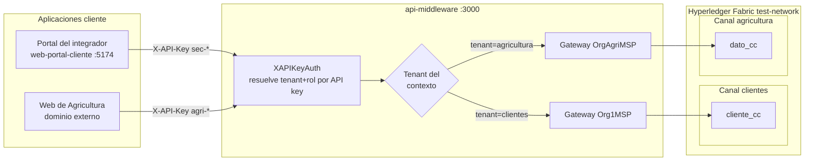
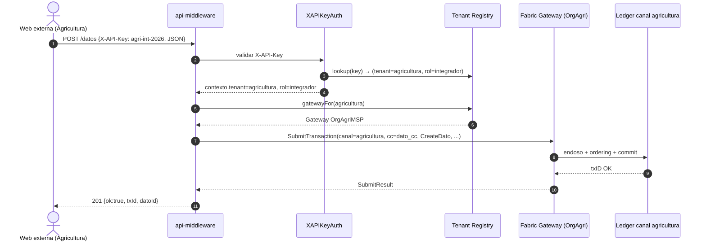

# Arquitectura multi-tenant del middleware (BaaS)

Este documento describe cómo el `api-middleware` da servicio a **múltiples empresas (tenants)**, cada una con su propia cadena de bloques (canal Fabric) y, opcionalmente, su propio chaincode.

Tenant inicial soportado: **`clientes`** (sistema actual, Org1).  
Nuevo tenant: **`agricultura`** (empresa externa, OrgAgriculturaMSP).

---

## 1. Resumen visual



---

## 2. Principios

1. **Un tenant = una empresa = un canal Fabric privado.** Otros tenants no leen su `ledger`.
2. **Una API por todas las empresas.** Solo cambia `X-API-Key`; las URL del middleware son las mismas.
3. **Sin headers extra para el cliente.** El tenant se **deduce de la API key**; la web externa no manda `X-Tenant`.
4. **Compatibilidad hacia atrás.** Si `TENANTS_FILE` no existe, el middleware corre en modo *single-tenant* legacy (lo que ya funciona con Org1 + canal `clientes`).
5. **Identidad por tenant.** Cada tenant trae su MSPID, su par cert/llave y su peer.

---

## 3. Diccionario de tenants

| tenant | MSP | Canal Fabric | Chaincode | Modelo | Operado por |
|--------|-----|--------------|-----------|--------|-------------|
| `clientes` | Org1MSP | `clientes` | `cliente_cc` (tipado: 9 campos) | Cliente | Org1 (sistema base) |
| `agricultura` | OrgAgriMSP | `agricultura` | `dato_cc` (genérico: id + tipo + payload JSON) | JSON libre | OrgAgricultura |

**Roles en cada tenant** (mismos 3, escalables):

| Rol | Permisos |
|-----|----------|
| `admin` | Todo: registrar, editar, consultar, dar de baja, transferir tokens, etc. |
| `integrador` | Registrar, editar, consultar (sin operaciones sensibles tipo emisión de tokens). |
| `solo_lectura` | Solo `GET`. |

---

## 4. Mapeo de API keys → (tenant, rol)

Resuelto en `XAPIKeyAuth` (`internal/middleware/api_key_roles.go`).

Patrón sugerido para nuevas keys: `<tenant>-<rol>-<sufijo opcional>`.

| API key (ejemplo) | tenant | rol |
|-------------------|--------|-----|
| `sec-admin` | `clientes` | `admin` |
| `sec-int` | `clientes` | `integrador` |
| `sec-lect` | `clientes` | `solo_lectura` |
| `agri-admin-2026` | `agricultura` | `admin` |
| `agri-int-2026` | `agricultura` | `integrador` |
| `agri-lect-2026` | `agricultura` | `solo_lectura` |

**Compatibilidad legacy:** las variables actuales `API_KEY_ADMIN / API_KEY_INTEGRADOR / API_KEY_SOLO_LECTURA` se siguen aceptando y se asocian automáticamente al tenant `clientes`.

---

## 5. Flujo de una petición multi-tenant



---

## 6. Archivos clave y estructura propuesta

```
api-middleware/
├── config/
│   └── tenants.example.yaml         # Ejemplo (sin secretos)
├── internal/
│   ├── tenants/
│   │   ├── config.go                # Carga tenants.yaml y mapea api-keys
│   │   └── registry.go              # Gateways por tenant + lookup
│   ├── fabric/
│   │   ├── connection.go            # Connect() legacy + ConnectTenants()
│   │   └── gateway.go               # Funciones con tenantId
│   ├── middleware/
│   │   └── api_key_roles.go         # XAPIKeyAuth resuelve (tenant, rol)
│   └── handlers/
│       ├── cliente_handler.go       # Usa tenant del contexto
│       └── dato_handler.go          # (nuevo) CRUD genérico para dato_cc
└── .env.example                     # Apunta a TENANTS_FILE
```

---

## 7. Aislamiento entre tenants

| Recurso | Aislamiento |
|---------|-------------|
| Ledger | Canal Fabric distinto. Imposible leer del otro. |
| Identidad (MSP) | Cert + llave propios por tenant. |
| API key | Una key vale solo para un tenant; al revocarla el otro tenant no se afecta. |
| Auditoría / SSE | Eventos y bitácora etiquetados con `tenantId`. |
| Pruebas de carga | Reportes separados por tenant. |

---

## 8. Riesgos y mitigaciones

| Riesgo | Mitigación |
|--------|------------|
| Fuga de API key entre tenants | Rotación documentada en `onboarding-cliente-nuevo.md`; key con prefijo de tenant para auditoría rápida. |
| Caída de un peer | Política de endoso multi-org en cada canal (Org1 actúa como notario en `agricultura`). |
| Crecimiento del archivo `tenants.yaml` | Posible migración futura a tabla SQL/Vault. Por ahora YAML estático en disco con permisos restringidos. |
| Mezcla de auditorías en bitácora | Cada línea JSONL incluye `tenant`. |

---

## 9. Roadmap

| Paso | Entregable |
|------|------------|
| P1 | Este documento. |
| P2 | `tenants.example.yaml` + actualización `.env.example`. |
| P3 | Refactor `internal/fabric` a `map[tenant]*Gateway`. |
| P4 | `XAPIKeyAuth` devuelve `tenant+rol`. |
| P5 | Handlers existentes (cliente/token) leen tenant del contexto. |
| P6 | Bitácora + eventos SSE con `tenantId`. |
| P7-P8 | Añadir OrgAgricultura + canal `agricultura` a la red. |
| P9-P10 | `dato_cc` y deploy en canal `agricultura`. |
| P11 | Handlers `/datos` o documentar `/chaincode/invocar` para Agricultura. |
| P12 | Guía de onboarding para nuevos tenants. |
| P13 | Tests de aislamiento entre tenants. |
| P14 | Pruebas de carga por tenant (cierra Sprint 3.4). |
